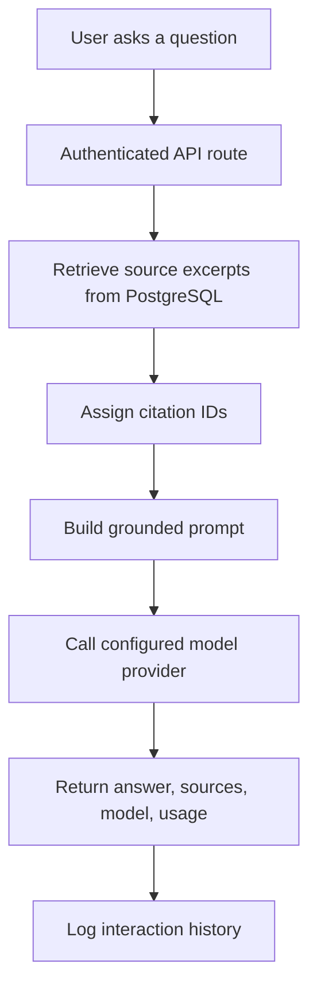
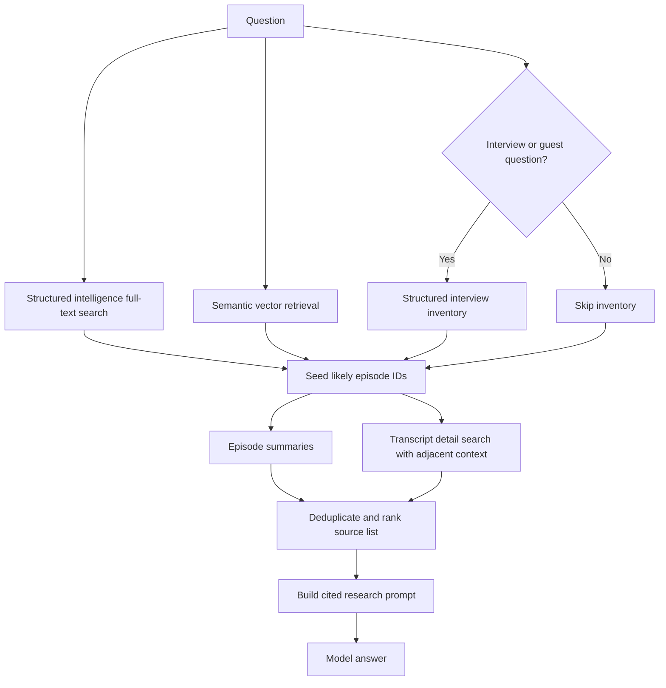

# AIC RAG Architecture

This document explains how retrieval augmented generation (RAG) works for the AIC website. It focuses on the website code path, not the upstream podcast ingestion jobs that create transcripts, intelligence, and vectors.

## Summary

The AIC RAG system does not ask the model to search the whole database directly. It first retrieves a bounded set of source excerpts from PostgreSQL, formats those excerpts with citation IDs, and then asks the selected model to answer only from that context.

There are two main RAG modes:

1. Episode/archive chat, used for episode-specific questions and the simpler archive chat endpoint.
2. Research agent, used by the full-corpus `/research` page and designed for broader archive research.

Both modes require a signed-in user, log the interaction to PostgreSQL, and store token usage when the model provider returns it.

## Request Flow



The model sees only the formatted retrieved context, not raw table access. The answer is expected to cite sources like `[S1]`, `[S2]`, and the UI keeps those sources available for review.

## API Surfaces

The current RAG API surfaces are:

- `app/api/research/chat/route.ts`
  - Calls `runResearchAgent`.
  - Used by the full-corpus Research page.
  - Scope: `research`.
  - Default `topK`: 18.

- `app/api/rag/chat/route.ts`
  - Calls `runRagChat`.
  - Used by general archive chat.
  - Scope: `archive`.
  - Can optionally receive a `trackId`.
  - Default `topK`: 10.

- `app/api/episodes/[trackId]/chat/route.ts`
  - Calls `runRagChat` with the route `trackId`.
  - Used for an individual episode.
  - Scope: `episode`.
  - Default `topK`: 10.

All three routes:

- Require `requireSignedInAppUser()`.
- Rate-limit by Clerk user ID.
- Validate the question and request body.
- Record completed and failed interactions with `recordRagInteraction`.
- Return normalized token usage but do not return raw provider usage JSON.

## PostgreSQL Sources

The answer path depends on PostgreSQL. SQLite should be treated as historical/reference only for current RAG work.

The main tables used by RAG are:

- `episodes`
  - Episode metadata such as track ID, title, publish date, and source file.

- `transcript_chunks`
  - Chunked transcript text.
  - Stores embeddings, timing, speakers, and text used by semantic retrieval.

- `episode_intelligence`
  - Episode-level structured summaries, long summaries, status, source model, and search text.

- `episode_intelligence_items`
  - Structured extracted items such as topics, interviews, stories, references, and similar intelligence records.

- `episode_intelligence_vectors`
  - Embeddings over structured intelligence text.

- `transcript_segments`
  - Normalized transcript segments with timing and full-text search vectors.
  - Used by the research agent for detail escalation after likely episodes are identified.

- `transcript_references`
  - Normalized reference records available to episode detail surfaces. Broad RAG currently relies mainly on intelligence items and transcript text search rather than querying this table directly.

- `rag_interactions`
  - User-visible history for questions and answers.
  - Stores scope, track ID, question, answer, sources, retrieval lanes, model/provider, status, error, duration, and token counts.

- `agent_settings`
  - Admin-configured model provider, model name, reasoning effort, and optional system API key.

- `aic_users` and `aic_user_roles`
  - User identity and role-based access control.

## Episode And Archive Chat

The simpler chat path is implemented in `lib/rag-chat.ts` by `runRagChat`.

It works like this:

1. Trim and validate the question.
2. Call `getEpisodeRagSources` from `lib/podcast-data.ts`.
3. Embed the question.
4. Search these vector stores:
   - `transcript_chunks`
   - `episode_intelligence_vectors`
5. Optionally restrict results to one `trackId`.
6. Keep matches with a similarity score above `0.2`.
7. Sort by score and keep the requested `topK`.
8. Add episode summaries for the top matched episodes.
9. Assign citation IDs.
10. Build the grounded prompt.
11. Call the configured model provider.

This path is best for:

- Asking about one episode.
- Asking a targeted archive question.
- Getting source-backed answers from transcript chunks and intelligence vectors.

Its main limitation is that it is primarily vector retrieval. If a question needs exact inventory, exact wording, or narrow keyword matching, the full research agent is usually stronger.

## Research Agent

The full research path is implemented in `lib/rag-chat.ts` by `runResearchAgent`.

It is designed to answer broader questions across the full sermon archive. It retrieves from multiple lanes, combines them, deduplicates them, and tells the model what kind of evidence each lane represents.

### Retrieval lanes

The research agent uses these lanes:

- Structured intelligence
  - Full-text search over `episode_intelligence` and `episode_intelligence_items`.
  - Good for topics, summaries, interviews, stories, names, passages, and extracted metadata.

- Semantic retrieval
  - Vector matches from `transcript_chunks` and `episode_intelligence_vectors`.
  - Good for conceptually related language that may not share the exact query terms.

- Detail transcript search
  - Full-text search over `transcript_segments`.
  - Runs against likely episodes discovered by the other lanes.
  - Pulls adjacent transcript segments for context.
  - Good for exact wording and tighter evidence.

- Episode summaries
  - Episode-level summaries added after candidate episodes are identified.
  - Good for orientation, but not treated as primary evidence for exact wording.

### Research flow



For normal questions, the research agent cites up to 40 sources. For interview or guest inventory questions, it can cite up to 72 sources because those questions often need a broader candidate list.

The response also includes a coverage note, for example:

- How many source excerpts were retrieved.
- How many episodes were represented.
- Whether transcript detail escalation found matches.
- Whether interview inventory was included.

## Prompt Contract

The RAG prompt has a strict grounding contract:

- Use only the supplied AIC corpus context.
- Cite claims with source IDs such as `[S1]`.
- Prefer transcript/detail sources for exact wording.
- Treat structured intelligence as an index and orientation.
- Do not invent guests, dates, quotations, scripture references, or episode titles.
- If evidence is incomplete, say so clearly.

This does not make the model incapable of mistakes. The real audit surface is the combination of:

- The retrieved source list.
- The citations in the answer.
- The stored interaction record.
- The source snippets shown in the UI.

## Model Provider And Admin Settings

Model settings are read from `agent_settings` through `lib/agent-settings.ts`.

The runtime provider can be:

- `silo`
- `openai`

For Silo, the default chat URL is:

```text
http://192.168.1.195:4041/v1/chat/completions
```

unless `SILO_CHAT_URL` overrides it.

For OpenAI direct calls, the default URL is:

```text
https://api.openai.com/v1/chat/completions
```

unless `OPENAI_CHAT_URL` overrides it.

The admin settings support:

- Provider selection.
- Model selection.
- Reasoning effort when the selected model advertises reasoning effort levels.
- A saved system API key.
- RAG retrieval limits for archive chat, research source budgets, candidate episodes, detail excerpts, and final cited-source caps.

The saved API key is used server-side and is not returned to the browser. The UI only receives whether a key exists and when it was updated.

Retrieval limits are saved on the same `agent_settings` row. They act as server-side defaults and caps. The important values are:

- Archive matches and archive cited-source cap.
- Research first-pass source budget per lane.
- Research candidate episode count.
- Research summary episode count.
- Research detail excerpt count.
- Standard research cited-source cap.
- Interview inventory and interview cited-source caps.

## Token Usage

The model response usage is normalized into:

- `total_tokens`
- `input_tokens`
- `output_tokens`

The normalizer accepts both OpenAI-style fields and common aliases:

- `input_tokens` or `prompt_tokens`
- `output_tokens` or `completion_tokens`
- `total_tokens` or `total`

The normalized counts are returned to the UI. Raw provider usage is saved in `rag_interactions.usage_json` for server-side auditing, but it is not returned to the browser response.

## Interaction History

Each RAG request is logged by `recordRagInteraction`.

The stored data includes:

- Clerk user ID and email.
- Scope: `research`, `archive`, or `episode`.
- Optional episode track ID.
- Question.
- Answer.
- Provider and model.
- Requested `topK`.
- Retrieval lanes.
- Sources.
- Top episode IDs.
- Coverage note.
- Token usage.
- Raw usage JSON.
- Status: `completed` or `failed`.
- Error text for failures.
- Duration in milliseconds.

The UI can read recent user history through the history API and restore prior questions, answers, sources, lanes, model/provider diagnostics, and token usage.

## Security Model

The RAG APIs require a signed-in app user.

The app role model is:

- `User`
- `Admin`

Every signed-in user receives normal user access. Admin users can manage agent settings and assign roles.

The current admin account seed is `michael@ammonsfarm.org`.

## What RAG Can Do Well

The current design is strongest for:

- Finding relevant sermon excerpts by theme or wording.
- Comparing several episodes on a topic.
- Finding likely episodes that mention people, places, books, Bible passages, topics, or interviews when those items are in transcript text or structured intelligence.
- Answering with citations and source snippets.
- Preserving per-user research history.
- Tracking provider/model/token usage for operational review.

## Known Limits

The system is only as complete as the indexed transcript and intelligence data.

Important limits:

- The model cannot see unretrieved episodes.
- Vector retrieval can miss exact names or rare phrases.
- Structured intelligence is derived data and should not override transcript evidence for exact wording.
- Inventory answers should be treated as bounded by retrieved structured inventory unless the sources prove completeness.
- `transcript_references` is available in the database, but the broad research agent currently does not directly query it as a first-class retrieval lane.
- Speaker attribution is not central to the website reading experience and should not be treated as the main proof surface.

## Key Files

- `lib/rag-chat.ts`
  - Main RAG orchestration, prompt building, model calls, token usage extraction, and research-agent lanes.

- `lib/podcast-data.ts`
  - Episode data access and vector retrieval from transcript chunks and intelligence vectors.

- `lib/rag-interactions.ts`
  - Interaction logging and user history reads.

- `lib/agent-settings.ts`
  - Runtime model/provider/API key selection.

- `lib/agent-models.ts`
  - Model list loading and reasoning effort capability normalization.

- `components/rag-chat-widget.tsx`
  - Frontend chat widget, history display, source display, and diagnostics.

- `app/api/research/chat/route.ts`
  - Full-corpus research endpoint.

- `app/api/rag/chat/route.ts`
  - General archive chat endpoint.

- `app/api/episodes/[trackId]/chat/route.ts`
  - Episode-specific chat endpoint.

- `postgres/migrations/001_init.sql`
  - Core transcript and intelligence tables.

- `postgres/migrations/003_transcript_segments.sql`
  - Normalized transcript segments and references.

- `postgres/migrations/005_security_agent_history.sql`
  - User roles, agent settings, and RAG interaction history.

- `postgres/migrations/006_agent_reasoning_usage.sql`
  - Reasoning effort and token usage columns.

- `postgres/migrations/007_rag_retrieval_settings.sql`
  - Admin-configurable RAG retrieval budgets and cited-source caps.

## Practical Debug Checklist

When a RAG answer looks wrong or incomplete, check:

1. Whether the episode has transcript data.
2. Whether the episode has intelligence data.
3. Whether transcript chunks and intelligence vectors exist.
4. Whether `transcript_segments.search_tsv` can find the exact phrase.
5. Which retrieval lanes returned sources.
6. Whether the model cited transcript/detail evidence or only summaries.
7. The saved `rag_interactions` row for sources, usage, provider, model, and error state.
8. Whether the configured model/provider changed in admin settings.
